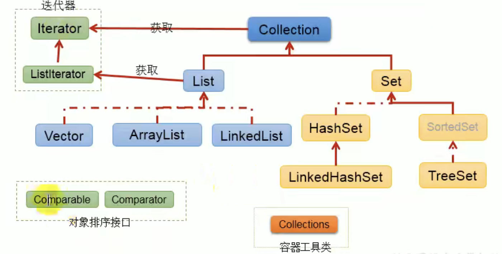
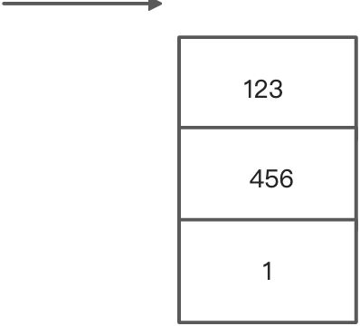
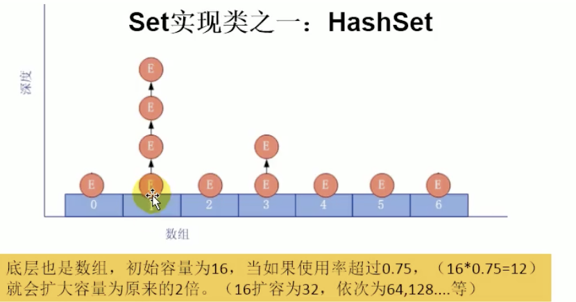
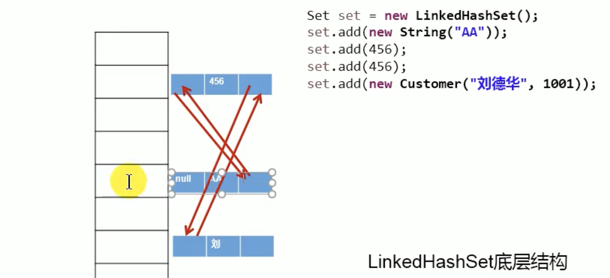
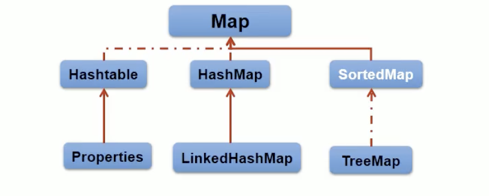

# Collection

## Collection：单列数据 定义了存储一组对象的方法的集合

**List**接口有序 可重复的数据集合 动态数组

- ArrayList 主要实现类 线程不安全 效率低 底层使用 Object\[] 存储 elementData

```java
    public void testString() {
        Collection coll = new ArrayList();
        coll.add(123);
        coll.add(345);

        Collection coll1 = new ArrayList();
        coll1.add(345);
        coll1.add(123);
        System.out.println(coll.equals(coll1)); // false ArrayList 根顺序也有关

    }
```

- LinkedList 对于频繁的插入 删除操作 使用此类效率比 ArrayList 效率高 **底层使用双向链表存储**
- Vector 古老实现类 线程安全 效率低 底层使用 Object\[] 存储

```java
    @Test
    public void testCollection() {
        Collection coll = new ArrayList();

        coll.add(1);
        coll.add(1L);
        coll.add(new Date());
        // size()  集合中元素的个数
        System.out.println(coll.size());
        // coll.toString()
        // [1, 1, Wed Feb 09 08:45:16 CST 2022]
        System.out.println(coll);

        // isEmpty 判断集合是否为空
        System.out.println(coll.isEmpty());
        // clear() 清空集合元素
        coll.clear();
        // []
        System.out.println(coll);
    }
```

## ArrayList 源码分析

```java
// 构造器
public ArrayList() {
    // new ArrayList 的时候 先默认赋值为一个空的常量
        this.elementData = DEFAULTCAPACITY_EMPTY_ELEMENTDATA;
    }


private static final Object[] DEFAULTCAPACITY_EMPTY_ELEMENTDATA = {};


// 如果调用add
public boolean add(E e) {
        modCount++;
        add(e, elementData, size);
        return true;
    }

// 执行这个add
 private void add(E e, Object[] elementData, int s) {
     // 如果当前存放的elementData的长度和size相同的话 则需要去扩容
        if (s == elementData.length)
            elementData = grow();
        elementData[s] = e;
        size = s + 1;
    }


private Object[] grow() {
        return grow(size + 1);
    }

private Object[] grow(int minCapacity) {
    // 扩容操作
        return elementData = Arrays.copyOf(elementData,
                                           newCapacity(minCapacity));
    }

private static final int DEFAULT_CAPACITY = 10;

 private int newCapacity(int minCapacity) {
        // overflow-conscious code
        int oldCapacity = elementData.length;
     // 新的容量为老的容量的1.5倍数
        int newCapacity = oldCapacity + (oldCapacity >> 1);
     // 如果扩容完之后的容量仍下小于最小的容量
        if (newCapacity - minCapacity <= 0) {
            if (elementData == DEFAULTCAPACITY_EMPTY_ELEMENTDATA)
                // 如果是第一次赋初始值 则比较最小的容量和 默认的容量比较
                // private static final int DEFAULT_CAPACITY = 10;
                return Math.max(DEFAULT_CAPACITY, minCapacity);
            if (minCapacity < 0) // overflow
                throw new OutOfMemoryError();
            return minCapacity;
        }
     //private static final int MAX_ARRAY_SIZE = Integer.MAX_VALUE - 8;
     // 此时的新容量已经是大于了最小的容量
     // 如果最大的容量已经超过了数组的最大的容量
        return (newCapacity - MAX_ARRAY_SIZE <= 0)
            ? newCapacity
            : hugeCapacity(minCapacity);
    }

  private static int hugeCapacity(int minCapacity) {
        if (minCapacity < 0) // overflow
            throw new OutOfMemoryError();
      // 最小需求容量已经大于了数组的长度 则用Interger的最大值
        return (minCapacity > MAX_ARRAY_SIZE)
            ? Integer.MAX_VALUE
            : MAX_ARRAY_SIZE;
    }
```

## LinkeList 源码解析

```java

  public void testS() {
        List list = new LinkedList();
        list.add("123");
    }

// new LinkedList()的时候
// 构造器没有做任何操作
public LinkedList() {
    }

// 调用list.add的时候
public boolean add(E e) {
        linkLast(e);
        return true;
    }


 public boolean add(E e) {
        linkLast(e);
        return true;
    }

 void linkLast(E e) {
     //指向末尾元素
        final Node<E> l = last;
     // 新建链表节点
     // 这里完成了双链表的前置链表的指向 newNode.prev = l
        final Node<E> newNode = new Node<>(l, e, null);
     // 尾指针往后移动
        last = newNode;
        if (l == null)
            // 如果没有元素 则 头指针和尾指针指向新的newNode元素
            first = newNode;
        else
            // 前一个指针指向了新new的指针 完成链表连接
            l.next = newNode;
        size++;
        modCount++;
    }


private static class Node<E> {
        E item;
        Node<E> next;
        Node<E> prev;

        Node(Node<E> prev, E element, Node<E> next) {
            this.item = element;
            this.next = next;
            this.prev = prev;
        }
    }

--------AbstractCollection 重写了toString的方法
        public String toString() {
        Iterator<E> it = iterator();
        if (! it.hasNext())
            return "[]";

        StringBuilder sb = new StringBuilder();
        sb.append('[');
        for (;;) {
            E e = it.next();
            sb.append(e == this ? "(this Collection)" : e);
            if (! it.hasNext())
                return sb.append(']').toString();
            sb.append(',').append(' ');
        }
    }
```

## Collection 的常用方法

```java
   @Test
    public void testCollection() {
        Collection coll = new ArrayList();

        coll.add(1);
        coll.add(1L);
        coll.add(new Date());
        // size()  集合中元素的个数
        System.out.println(coll.size());
        // coll.toString()
        // [1, 1, Wed Feb 09 08:45:16 CST 2022]
        System.out.println(coll);

        // isEmpty 判断集合是否为空
        System.out.println(coll.isEmpty());
        // clear() 清空集合元素
//        coll.clear();
        // []
        System.out.println(coll);
        // contains()
        coll.contains(new Date());
        // containsAll() 所有元素是否都存在于当前集合中
        // ...
        // remove()
        boolean b = coll.remove(1);
        // removeAll(Collection c) 移除两个集合中的共同的元素  求差集

        //retainAll(Collection c) 获取两个集合中的交集 并且修改当前集合为此两个集合的交集

        // hashCode()
        System.out.println(coll.hashCode());

        // 集合 ==> 数组
        Object[] arr = coll.toArray();
        for (Object obj : arr) {
            System.out.println(obj);
        }

        // 数组 ===> 集合
        List<Integer> arr2 = Arrays.asList(new Integer[]{123, 456});
        System.out.println(arr2);
    }
```

## 迭代器使用

> 注意迭代器的 remove 使用

```java
    @Test
    public void testString() {
        // 迭代器 Iterator
        Collection coll = new ArrayList();
        coll.add(123);
        coll.add(345);

        Collection coll1 = new ArrayList();
        coll1.add(345);
        coll1.add(123);
        System.out.println(coll.equals(coll1)); // false ArrayList 根顺序也有关
        Iterator iterator = coll1.iterator();
        while(true) {
            if(!iterator.hasNext()) {
                break;
            }
            System.out.println("iterator.next() = " + iterator.next());
        }
    }


Iterator iterator1 = coll1.iterator();
        iterator1.next();
        //  remove 可以删除集合的元素 但是是遍历过程中通过迭代器对象的remove方法 而不是直接通过集合的remove方法
        //  删除了coll1 中的第一个元素
        //  如果还没有调用next（） 或者 在上一次调用完了remove（）之后在调用remove 就报错illegalStateException
        iterator1.remove();
        while (true) {
            if (!iterator1.hasNext()) {
                break;
            }
            System.out.println("iterator1.next() = " + iterator1.next());
        }
        for(Object obj : coll1) {
            System.out.println(obj);
        }
```

# List 接口方法



```java
 @Test
    public void st() {
        List<String> arr = new ArrayList<>();
        arr.add("123");
        arr.add("1234");
        arr.add("12345");
        // add(int index, E e)
        arr.add(1, "array");
        System.out.println(arr);
        List<String> arr1 = new ArrayList<>();
        arr1.add("123");
        // addAll(int index, Collection e) //
        // addAll(Collection e)
        arr1.addAll(1, arr);
        System.out.println(arr1);
        // get
        System.out.println(arr1.get(2));
        // indexOf
        // lastIndexOf
        // remove(int index) 移除指定的元素返回删除的元素
        // set
        // subList（int begin ， int end) 左闭右开
    }
```

## 注意 Collection 接口的 remove 和 List 接口的 remove

```java
Collection接口的remove
boolean remove(Object o);
List接口的remove
E remove(int index);

如果arrayList调用的是
arr.remove(2) // 删除的是索引值
arr.move(new Integer(2)) 删除的是值
```

## 迭代器原理

```java
Iterator iterator = coll1.iterator();
```

在执行 coll1.iterator() 的时候指针会在当前集合的栈空间的顶部（例如位于 - 1 位置）

当执行 hasNext 的时候 指针下移 判断当前位置是否有元素 然后恢复指针初始位置
next 时候 指针下移 并且将下移以后的位置上的元素返回

- Iterator 仅用于遍历集合 Iterator 本身并不提供承装对象的能力 如果需要创爱你 Iterator 对象 则必须要有一个被迭代的组合
- 集合对象每次调用 Iterator() 方法都能得到一个全新的迭代器对象 默认的指针在集合的第一个元素之前

# Set：元素无序 不重复的集合

- HashSet 作为 set 的主要实现类 线程不安全 可以存储 null 值
  - LinkedHashSet 作为 hashSet 的子类 遍历其内部结构时 可以按照添加的顺序遍历
- TreeSet 底层红黑树 可以按照添加对象的指定属性 进行排序

## hashSet

**无序性 ： 存储的数据在底层数组中并非按照数组的索引的顺序添加的 而是根据数据的 hash 值决定的**
**不可重复性： 保证添加的元素按照 equals()判断时 不能返回 true（调用的是元素的 equals）**
**hashSet 开始的数组的长度是 16**
**hashSet 运用了数组和链表的结合**

## Set 的无序的原因

**向 hashSet 添加了一个元素 a 首先调用元素 a 所在类的 hashCode()方法 计算元素 a 的哈希值 此哈希值接着通过某种算法计算出在 HashSet 底层数组中存放的位置(即 索引位置) 判断数组此位置上是否有元素**
**如果没有其他元素 则元素 a 添加成功**
**如果有其他元素(或者以链表形式存在的多个元素) 则比较元素 a 与元素 b 的 hash 值**
**hash 值不相同 则元素 a 添加成功**
**hash 值相同 今儿调用元素 a 的 equals 方法判断是否与元素 b 相同**
**equals 返回 true 表示相同 元素添加失败**
**equals 返回 fasle 表示不同 元素添加成功**

> JDK7 中 添加的元素 a 放在数组中 指向原来的元素
> JDK8 中 原来的元素指向元素 a

**向 Set 中添加的数据 如果是一个引用类型 则其类需要去重写 hashCode 和 equals 方法**

> **相等的对象必须具有相等的散列码**



```java
new hashSet()

    // new 了一个hashMap
    public HashSet() {
        map = new HashMap<>();
    }
```

## hashCode 重写

```java
// 会根据变量值的不同进行生成不同的hashCode
public int hashCode() {
        int result = num;
        result = 31 * result + (str != null ? str.hashCode() : 0);
        return result;
    }
```

> 关于为什么重写 hashCode 的时候会有 31 这个数字
>
> 1. 尽量选择饿大的系数 计算的 hash 地址越大 冲突就会越少 查找的效率就会越高
> 2. 31 只占用了 5bits 相乘造成数溢出的概率较小
> 3. 31 可以由 i \* 31 = (i << 5) - 1 得到
> 4. 31 是个素数 （可以有效减少冲突）

## LinkedHashSet

LinkedHashSet 作为 hashSet 的子类 在添加数据的同时 每个数据还维护了一对前后指针
对于频繁的遍历操作 LinkedHashSet 的效率要高于 hashSet


## TreeSet

TreeSet add 添加的属性必须由同一个类提供
**TreeSet 比较相同调用的是 compareTo()**
**TreeSet 以及 TreeMap 采用红黑树的结构**

### 自然排序

以 compareTo 来排序

```java
 @Test
    public void testTreeSet() {
        TreeSet treeSet = new TreeSet();
        treeSet.add(new TestTreeSetClass(3, "12345"));
        treeSet.add(new TestTreeSetClass(2, "123"));
        treeSet.add(new TestTreeSetClass(1, "123"));
        treeSet.add(new TestTreeSetClass(1, "1234"));
        treeSet.add(new TestTreeSetClass(2, "123"));

        Iterator iterator = treeSet.iterator();
        while (iterator.hasNext()) {
            System.out.println(iterator.next());
        }

    }

    /**
     * 测试treeSet的自然排序
     */
    class TestTreeSetClass implements Comparable {
        public int number;
        public String str;

        public TestTreeSetClass() {

        }

        public TestTreeSetClass(int number, String str) {
            this.number = number;
            this.str = str;
        }


        @Override
        public int compareTo(Object o) {
            if (o instanceof TestTreeSetClass) {
                if (((TestTreeSetClass) o).number > this.number) {
                    return -1;
                } else if (((TestTreeSetClass) o).number == this.number) {
                    if (((TestTreeSetClass) o).str.equals(this.str)) {
                        return 0;
                    } else if (((TestTreeSetClass) o).str.compareTo(this.str) > 0) {
                        return -1;
                    } else return 1;
                } else {
                    return 1;
                }
            }
            return 0;
        }

        @Override
        public String toString() {
            return "TestTreeSetClass{" +
                    "number=" + number +
                    ", str='" + str + '\'' +
                    '}';
        }
```

### 定制排序

以 Comparator 的对象在创建 TreeSet 对象时指定排序规则

```java

    @Test
    public void comparatorTestTreeSett() {
        // 倒叙排序
        Comparator comparator = new Comparator() {
            @Override
            public int compare(Object o1, Object o2) {
                if (o1 instanceof TestTreeSetClass && o2 instanceof TestTreeSetClass) {
                    if (((TestTreeSetClass) o1).number > ((TestTreeSetClass) o2).number) {
                        return -1;
                    } else if (((TestTreeSetClass) o1).number == ((TestTreeSetClass) o2).number) {
                        if (((TestTreeSetClass) o1).str.equals(((TestTreeSetClass) o2).str)) {
                            return 0;
                        } else if (((TestTreeSetClass) o1).str.compareTo(((TestTreeSetClass) o2).str) > 0) {
                            return -1;
                        } else return 1;
                    } else return 1;
                }
                throw new RuntimeException("输入类型有误");
            }
        };
        TreeSet treeSet = new TreeSet(comparator);
        treeSet.add(new TestTreeSetClass(5, "123"));
        treeSet.add(new TestTreeSetClass(2, "123"));
        treeSet.add(new TestTreeSetClass(3, "123"));
        treeSet.add(new TestTreeSetClass(4, "123"));
        treeSet.add(new TestTreeSetClass(2, "1234"));

        for (Object o : treeSet) {
            System.out.println(o);
        }
    }
```

## set 添加 demo

```java
  /**
     * 先比较hashCode 在比较equals
     */
    @Test
    public void test() {
        Person p1 = new Person(1001, "AA");
        Person p2 = new Person(1002, "BB");
        HashSet set = new HashSet();
        set.add(p1);
        set.add(p2);
        p1.setName("CC");
        // remove 会根据hashCode 去查找当前的值保存在哪里
        // 因为改变了name 导致了hashCode的值也改变了 则找不到原来的p1的元素位置 则无法删除成功
        set.remove(p1);
        System.out.println(set);
        set.add(new Person(1001, "CC")); // [Person{name='CC', id=1001}, Person{name='BB', id=1002}]
        // 第一个的hashCode 是根据new Person(1001,"AA") 计算出来的 所以添加cc不会覆盖
        System.out.println(set); // [Person{name='CC', id=1001}, Person{name='CC', id=1001}, Person{name='BB', id=1002}]
        // hashCode相同和第一个元素 当时equals不同
        set.add(new Person(1001,"AA"));
        System.out.println(set);
    }
```

# Map

具有 key-value 对的映射关系的集合

- HashMap Map 的主要实现类 线程不安全 效率高 **可以存储 null 的 key 或者是 value**
- LinkedHashMap **保证在遍历 map 元素的时候 可以按照添加的顺序实现遍历**
- TreeMap 可以保证按照添加的 key-value 对进行排序 可以考虑 key 的自然排序或者是定制排序 底层也是使用的红黑树
- Hashtable Map 的以前实现类 线程安全 效率低 不能存储 null 的 key 或者是 value
- Properties 常用来处理配置文件 key 和 value 都是 String 类型

> 存储的 hashMap 为 null 而 Hashtable 不能为 null 的情况

```java
 @Test
    public void test() {
        HashMap map = new HashMap();
        map.put(null, null);

        Hashtable hashtable = new Hashtable();
        hashtable.put(null, null); // NullPointerException
    }
```



## Map 结构的理解

Map 中的 key 无序的 不可重复的 使用 Set 存储所有的 key
key 所在的类要重写 equals() 和 hashCode() 以 equals 为例
Map 中的 value 无序的 可重复的 使用 Collection 存储所有的 value
value 所在的类要重写 equals()
一个键值对 key-value 构成了一个 Entry 对象

## hashMap 底层实现

```java
HashMao map = new HashMap();

实例化以后 底层创建了长度为16的一位数组Entry[] table;

map.put(key,value);
map.put(key1,value1);
// 首先 会调用key1所在类的hashCode() 计算key1hash值 此hash值经过某种算法计算过后 得到在Entry数组中存放的位置
// 如果此位置上的数据为空 此时的key1-value1 则会被添加到数组中
// 如果此时的数据不为空 (意味着 此位置上存在一个或多个数据（以链表的形式存储） 表key1和以及存在的一个或者多个数据的hash值)：
// 如果key1的hash值与已经存在的hash值不相同 则 key1-value1添加成功
//  如果此时的key1的hash值与已经存在的hash值相同:
//  则调用key1的equals方法 如果返回true 则使用value1 替代掉原来key1映射的元素
//      如果返回的是false 则key1-value2添加成功

// 如果一位数组上原有数据 则此时会以链表的形式存储数据
// 不断添加的过程中的扩容问题 默认的扩容方式 扩容为原来的2倍 并且复制原有的数据
```

JDK8 与 JDK7 的不同

1. new HashMap 底层不会立即创建一个长度为 16 的数组
2. jdk8 的底层数组是 Node\[] 而非 Entry\[]
3. 首次调用 put()方法时 底层创建长度为 16 的数组
4. jdk7 底层只有数组 + 链表的结构 jdk8 底层的结构是 数组 + 链表 + 红黑树
5. 当输入的某一个索引位置上的元素以链表的形式存在的数据的个数 > 且数组的长度 > 64 时 此索引位置伤的所有数据改为使用红黑树存储

## 临界值

DEFAULT_INITIAL_CAPACITY ： HashMap 默认的容量 16
DEFAULT_LOAD_FACTOR ： 加载因子
treshold 扩容的临界值
TREEIFY_THRESHOLD ： Bucket 中表链长度大于该默认值 转化为红黑树
MIN_TREEIFY_CAPACITY： 桶中的 Node 被树转化时最小的 hash 表容量:64
如果求一个数的不超过多少值 可以用& 大于它的二进制会全部变成 0

```java
HashMap map = new HashMap();
public HashMap() {
// 加载因子 DEFAULT_LOAD_FACTOR
  this.loadFactor = DEFAULT_LOAD_FACTOR; // all other fields defaulted
    }
```

> 加载因子
>
> [HashMap 默认加载因子为什么选择 0.75？(阿里)](https://www.cnblogs.com/aspirant/p/11470928.html)

JDK 8 初始化的时候不会指定默认数组

进行 put 操作:

```java
public V put(K key, V value) {
        return putVal(hash(key), key, value, false, true);
    }


static final int hash(Object key) {
        int h;
        return (key == null) ? 0 : (h = key.hashCode()) ^ (h >>> 16);
    }


final V putVal(int hash, K key, V value, boolean onlyIfAbsent,
                   boolean evict) {
        Node<K,V>[] tab; Node<K,V> p; int n, i;
        // 判断是否是第一次初始化 (tab = table) == null
        // 判断是否没有值 (n= tab.length) == 0
        if ((tab = table) == null || (n = tab.length) == 0)
            n = (tab = resize()).length;
        // n(n - 1) & hash 位置存放的元素是否有值 没有值则直接插入
        if ((p = tab[i = (n - 1) & hash]) == null)
            tab[i] = newNode(hash, key, value, null);
        else {
            Node<K,V> e; K k;
            // p 代表了 Node<K,V>[] table 中的某一项
            // 如果这一项的hash值相同 并且key的值也相同
            if (p.hash == hash &&
                ((k = p.key) == key || (key != null && key.equals(k))))
            // 将现在的这一项p赋值给e 有e.value = value;
            // 相当于替换了 p这一项的value
                e = p;
            //    红黑树的存储过程 暂时不了解
            else if (p instanceof TreeNode)
                e = ((TreeNode<K,V>)p).putTreeVal(this, tab, hash, key, value);
            else {
                // 这里就是链表往下查找到末尾并且比对是否存在与链表上的某一个节点
                // 如果存在 则替换 结束循环 不存在一直找到链表尾部
                for (int binCount = 0; ; ++binCount) {
                    if ((e = p.next) == null) {
                        //  在链表尾部添加元素
                        p.next = newNode(hash, key, value, null);
                        if (binCount >= TREEIFY_THRESHOLD - 1) // -1 for 1st
                            treeifyBin(tab, hash);
                        break;
                    }
                    if (e.hash == hash &&
                        ((k = e.key) == key || (key != null && key.equals(k))))
                        break;
                    p = e;
                }
            }
            // 如果上述的尾部已经添加过 则不走这里 上述的 (e = p.next) == null
            // 如果链表对比有相同的值 则这个值最终赋值给e
            // 下面的e 做value替换
            if (e != null) { // existing mapping for key
                V oldValue = e.value;
                // p.next = newNode(hash, key, value, null);
                if (!onlyIfAbsent || oldValue == null)
                    e.value = value;
                // 链表插入节点后面
                afterNodeAccess(e);
                return oldValue;
            }
        }
        ++modCount;
        // 临界值 threshold
        if (++size > threshold)
            // 扩容
            resize();
        afterNodeInsertion(evict);
        return null;
    }
```

## Map 常用方法

```java
 @Test
    public void test() {
        // hashMap的常用方法
        HashMap map = new HashMap();

        map.put("a", 1);
        map.put("b", 1);
        map.put("c", 1);
        map.put("d", 1);


        HashMap map1 = new HashMap();
        map1.putAll(map);


        map1.remove("c");

        map.clear();

        System.out.println(map.size()); // 0
        System.out.println(map1);
    }


    @Test
    public void ts() {
        HashMap map = new HashMap();

        map.put("a", 1);
        map.put("b", 1);
        map.put("c", 1);
        map.put("d", 1);

        System.out.println(map.get("a"));


        boolean isExist = map.containsKey("b");
        boolean isValue = map.containsValue(1);
        System.out.println(isExist);
        System.out.println(isValue);


        HashMap map1 = new HashMap();

        map1.put("a", 1);
        map1.put("b", 1);
        map1.put("c", 1);
        map1.put("d", 1);

        System.out.println(map.equals(map1));

    }
```

## 遍历 Map

> 遍历所有的 key 拿到 set

```java
  @Test
    public void forHashMap() {
        // 循环遍历
        HashMap map = new HashMap();

        map.put("a", 1);
        map.put("b", 1);
        map.put("c", 1);
        map.put("d", 1);

        // 遍历所有的key集
        Set set = map.keySet();

        for (Object o : set) {
            System.out.println(o); // key
            System.out.println(map.get(o)); // value
        }


        // 获取entry集合
        Set set1 = map.entrySet();
        for (Object o : set1) {
            Map.Entry entry = (Map.Entry) o;
            System.out.println(entry.getKey());
            System.out.println(entry.getValue());
        }
    }
```

treeMap

## Properties

Properties 类是 Hashtable 的子类 该对象用于处理属性文件
key-value 都是 String 类型

```java
 @Test
    public void testNames() {
        Properties props = new Properties();
        try {
            FileInputStream fis = new FileInputStream("jdbc.properties");
            props.load(fis);
            String name = props.getProperty("name");
            String password = props.getProperty("password");
            System.out.println(name);
            System.out.println(password);
        } catch (IOException e) {
            e.printStackTrace();
        }
    }
```

# Collections 工具类的使用

Collections

reverse(List) ：反转 List 中元素的顺序
shuffle(List): 根据元素的自然顺序对指定 List 集合元素按升序排序
sort(list) 按照升序排序
sort(List,Comparator): 根据指定的 Comparator 产生的顺序对 List 集合元素进行排序
swap(List, int, int ) ： 将指定 list 集合中 i 处元素 和 j 处元素进行交换
int frequency（Collection,Object）:返回指定集合中指定元素出现的次数
copy(List dest,List src) 将 src 中的内容复制到 dest 中
replaceAll(List list, Object oldVal, Object new Val) 使用新值替换 List 对象的 所有旧值

Collections 提供多个 synchrozedXxx()方法 可以将指定集合包装成线程不同的集合 从而解决多线程并发访问集合时的线程安全问题
