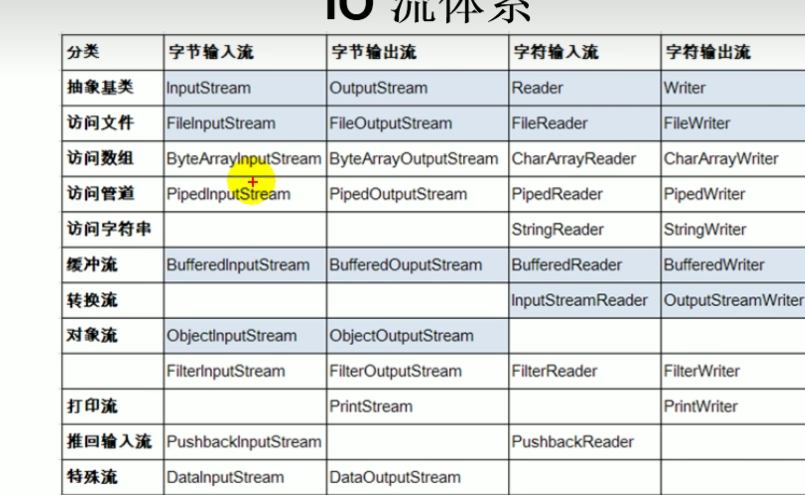

1. public File(String pathname) 以 pathname 为路径的建 File 对象，可以是绝对路径或者相对路径，如果 pathname 是相对路径，则默认的当前路径在系统属性 user.dir 中存储。
   1. 绝对路径：是一个固定的路径,从盘符开始
   2. 相对路径：是相对于某个位置开始
2. public File(String parent,String child)

以 parent 为父路径，child 为子路径创建 File 对象。

3. public File(File parent,String child)

根据一个父 File 对象和子文件路径创建 File 对象

### 分类

流向: 输入流 输出流
数据单位 字节流 字符流
流的角色 节点流 处理流
