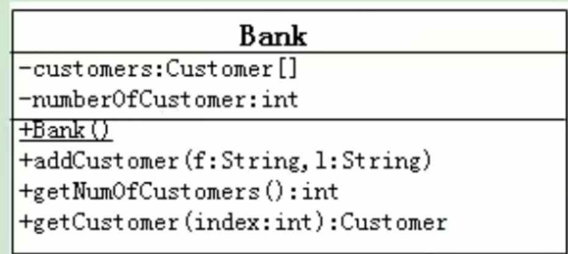
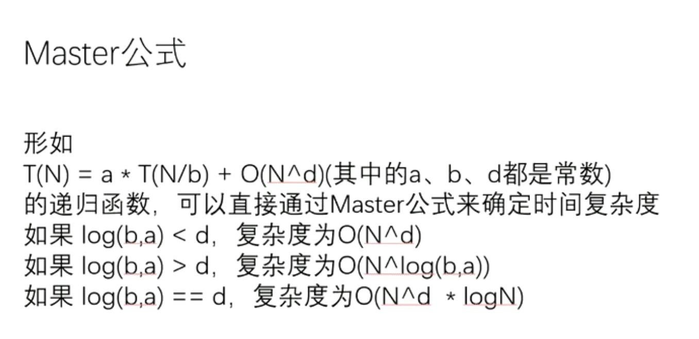
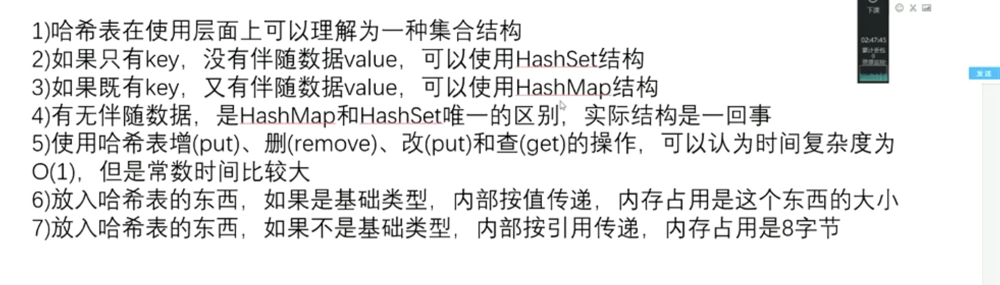

# JavaBean

JavaBean 是一种 Java 语言写成的可重用的组件
符合以下标准:

> 类是公共的
> 又一个无参的公共的构造器
> 有属性 且有对应的 get set 方法

# UML


Bank 为类名
属性名 : 属性的类型
**有下划线表示为构造器**
&#x20;\+ 表示 public 类型
&#x20;\- 表示 private 类型
&#x20;\# 表示 protected 类型
方法的写法:
方法的类型(+ - #) 方法名(参数名: 参数类型) :返回值类型

# package 关键字的使用

包 属于标识符 遵循命名规则(xxxxyyyzzz)
没.一次代表一层文件目录

# import 关键字的使用

1. 在源文件中显式使用 import 结构导入指定包下的类 接口
2. 声明在包的声明和类的声明之间
3. 如果需要导入多个结构 则并列写出即可
4. 可以用"xxx.\*"的方式 表示可以导入 xxx 包下的所有结构
5. 如果使用类或接口的是 java.lang 包下定义的 则可以省略 import 结构
6. 如果使用的类或者接口是本包下定义的 可以省略 import 结构
7. 在源文件中 使用了不同包下的同名的包的类 则必须至少有一个类需要以全类名的方式显示

```java
package study.bank;


import study.account.Account;
public class BankTest {
    public static void main(String[] args) {
        Bank bank = new Bank();
        bank.addCustomer("Jane", "Samith");
        bank.getCustomers(0).setAccount(new study.bank.Account(2000));
        bank.getCustomers(0).getAccount().withDraw(1500);
    }
}

```

8. 使用"xxx.\*"方式表明可以调用 xxx 包下的所有结构 但是如果使用的是 xxx 子包下的结构 则仍需要显示调用
9. **import static 导入指定类或接口中的静态结构: 属性或方法**

# JVM

JVM 会删除 一个内存空间不能够被任何引用的

# java 中 Scanner 类 nextInt 之后用 nextLine 无法读取输入

> 先用 nextInt()再用 nextLine()就会出现不会有接收字符串的结果。
> 究其原因，首先，Scanner 作为一个扫描器，它扫描数据都是去内存中一块缓冲区中进行扫描并读入数据的，而我们在控制台中输入的数据也都是被先存入缓冲区中等待扫描器的扫描读取。这个扫描器在扫描过程中判断停止的依据就是“空白符”，空格啊，回车啊什么的都算做是空白符。
> 其次，nextInt()方法在扫描到空白符的时候会将前面的数据读取走，但会丢下空白符“\r”在缓冲区中，而接下来，nextLine()方法自动读取了被 nextInt()丢下来的”\r”作为他的结束符，其实 nextLine()方法是执行过的，并不是没有执行。

## 解决方法

> nextLine()方法的结束符只是 Enter 键，即 nextLine()方法返回的是 Enter 键之前的所有字符，它是可以得到带空格的字符串的。

1. 可以在 nextInt()方法后面多加一句 nextLine()方法专门用来取出缓冲区中留下的空白符
2. 可以只用 nextLine()方法，然后通过 Integer 类中的 parseInt()方法解析成 int 数据。因为 nextLine()方法会自动清理掉后边的空白符，这种方法就不会产生最开始那种错误了
3. 将 nextLine()换成 next(),因为 next()一定要读取到有效字符后才可以结束输入，对输入有效字符之前遇到的空格键、Tab 键或 Enter 键等结束符，next()方法会自动将其去掉，只有在输入有效字符之后，next()方法才将其后输入的空格键、Tab 键或 Enter 键等视为分隔符或结束符。但是 next()方法不能得到带空格的字符串。

# Integer

Integer 在-128 ～ 127 时候 值为值传递 可以用 == 比较
大于 127 的时候 改为引用传递 要用 equals 比较

# hash

哈希表 增 删 改 差 在使用式 都是 o(1)



treeMap 的时间复杂度是 logN

# 包

包（package）是 Java 提供的一种区别类的名字空间的机制，是类的组织方式，是一组相关类和接口的集合，它提供了访问权限和命名的管理机制。

Java 中提供的包主要有以下 3 种用途:

1. 将功能相近的类放在同一个包中，可以方便查找与使用。

2. 由于在不同包中可以存在同名类，所以使用包在一定程度上可以避免命名冲突。

3. 在 Java 中，某次访问权限是以包为单位的。

# IDEA

> idea 将项目分为一个一个模块

在 idea 中最顶级的是 project 次级是 Module
可以在 project 创建多个 module

# utf8 gbk

gbk 支持中文
gbk 汉字占两个字节
utf8 的汉字占用是那个字节
