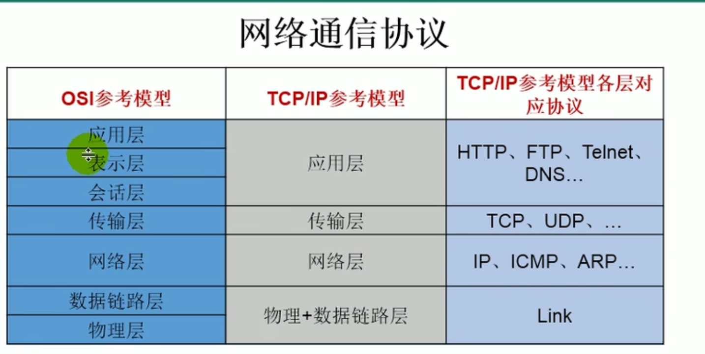
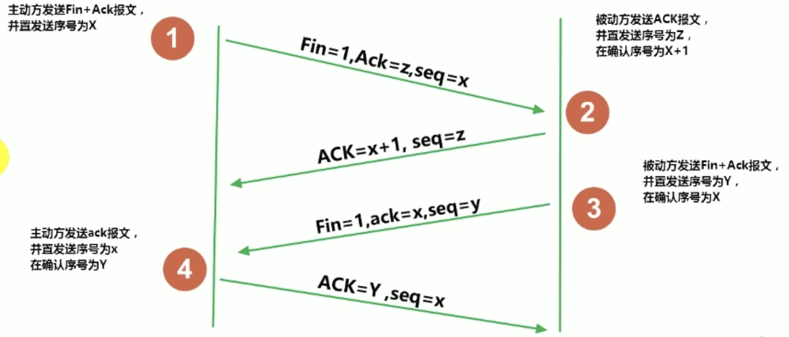

## ip 地址

ip 地址分为：

- ipv4
- ipv6
  又分为： 公网地址（万维网使用 ）和私网地址（局域网使用）
  > 192.168 开头的就是私有地址 范围在 192.168.0.0 ~ 192.168.255.255 专门为组织机构内部使用
  > 本机回路地址: `127.0.0.1`或者`localhost`
  > 常用的两个方法： `getHostName` `getHostAddress`

```java
@Test
public void ip() {
    try {
        // 获取host对应的id地址
        InetAddress inet = InetAddress.getByName("192.168.10.2");
        System.out.println(inet);
        InetAddress inet2 = InetAddress.getByName("www.baidu.com");
        System.out.println(inet2);
        // 获取主机名字
        System.out.println(inet2.getHostName());
        // 获取主机地址
        System.out.println(inet2.getHostAddress());
        // 获取本机地址
        InetAddress inet3 = InetAddress.getLocalHost();
        System.out.println(inet3);
    } catch (UnknownHostException e) {
        e.printStackTrace();
    }
}
```

#### 端口号

端口号标识正在计算机上运行的进程
不同的进程有不同的端口号
范围在 0-65535

- 0-1023 预先呗定义的服务通信占用
- 1024-49151 分配给 用户进程或应用程序的端口
- 49152-65535 动态/私有端口
  > ip 端口号与 Ip 地址的组合得出一个网络套接字： Socket

### 传输层的两个重要的协议

- 传输控制协议 TCP
- 用户数据报协议 UDP
  TCP 协议：

  > 使用 TCP 协议前，须先建立 TCP 连接，形成传输数据通道
  > 传输前，采用“三次握手”方式，点对点通信，是可靠的
  > TCP 协议进行通信的两个应用进程：客户端、服务端。
  > 在连接中可进行大数据量的传输
  > 传输完毕，需释放已建立的连接，效率低
  >
  > UDP 协议：
  > 将数据、源、目的封装成数据包，不需要建立连接
  > 每个数据报的大小限制在 64K 内
  > 发送不管对方是否准备好，接收方收到也不确认，故是不可靠的
  > 可以广播发送
  > 发送数据结束时无需释放资源，开销小，速度快



### TCP 三次握手


### TCP 四次挥手

客户端和服务端都能主动发起挥手操作


### TCP 初次使用

```java
package network;

import org.junit.Test;

import java.io.ByteArrayOutputStream;
import java.io.IOException;
import java.io.InputStream;
import java.io.OutputStream;
import java.net.InetAddress;
import java.net.ServerSocket;
import java.net.Socket;

/**
 * tcp通讯
 * 1. 客户端发送信息给服务端 服务端将数据显示在控制台上
 */
public class tcp {
    /**
     * 客户端
     */
    @Test
    public void client() {
        Socket socket = null;
        OutputStream outputStream = null;
        try {
            InetAddress inet = InetAddress.getByName("localhost");
            socket = new Socket(inet, 8888);
            // 获取写入的流
            outputStream = socket.getOutputStream();
            // 写入数据
            outputStream.write("传输的数据流".getBytes());

   socket.shutdownOutput(); // 通知结束输入

        } catch (IOException e) {
            e.printStackTrace();
        } finally {
            try {
                if (socket != null) socket.close();
                if (outputStream != null) outputStream.close();
            } catch (IOException e) {
                e.printStackTrace();
            }
        }
    }


    /**
     * 服务端
     */
    @Test
    public void service() {
        Socket socket = null;
        InputStream inputStream = null;
        try {
            // 创建一个服务端口
            ServerSocket ss = new ServerSocket(8888);
            // 获取来自客户端的socket
            socket = ss.accept();

            // 获取写入流
            inputStream = socket.getInputStream();

            int len = 0;
            // 直接使用String存储会存在乱码的情况 使用ByteArrayOutputStream 关闭
            ByteArrayOutputStream baos = new ByteArrayOutputStream();
            // String s = "";

            while ((len = inputStream.read()) != -1) {
                // s += (char) len;
                System.out.println(len);
                baos.write(len);
            }
            System.out.println(baos);

            // 获取远程发过来的地址
            InetAddress inet = socket.getInetAddress();
            System.out.println(inet.getHostAddress());
            System.out.println(inet.getHostName());

        } catch (IOException e) {
            e.printStackTrace();
        } finally {
            try {
                if (socket != null) socket.close();
                if (inputStream != null) inputStream.close();
            } catch (IOException e) {
                e.printStackTrace();
            }
        }
    }
}
```

### UDP 初次使用

数据报限定为 64kb

```java
package network;


import org.junit.Test;

import java.io.IOException;
import java.net.DatagramPacket;
import java.net.DatagramSocket;
import java.net.InetAddress;

/**
 * UDP 网络编程
 */
public class Udp {

    @Test
    public void sender() {
        // 发送数据
        DatagramSocket socket = null;
        try {
            // 创建socket
            socket = new DatagramSocket(8999);
            InetAddress inetAddress = InetAddress.getLocalHost();
            String str = "需要发送的数据";
            // 发送的数据包
            byte[] data = str.getBytes();
            DatagramPacket packet = new DatagramPacket(data, data.length, inetAddress, 9090);
            socket.send(packet);
        } catch (Error | IOException e) {
            e.printStackTrace();
        } finally {
            if (socket != null) socket.close();
        }
    }


    // 接收端
    @Test
    public void receiver() {
        DatagramSocket socket = null;
        try {
            socket = new DatagramSocket(9090);
            byte[] b = new byte[1024];
            DatagramPacket packet = new DatagramPacket(b, 0, b.length);
            // 读取udp的包协议内容
            socket.receive(packet);
            System.out.println(b);
            //  getData的数据就是b的数据
            System.out.println(packet.getData());
            System.out.println(packet.getData().length);
        } catch (IOException e) {
            e.printStackTrace();
        } finally {
            if (socket != null) {
                socket.close();
            }
        }
    }
}
```

### URL 初次使用

```java
package network;

import org.junit.Test;

import java.net.MalformedURLException;
import java.net.URL;

public class UrlClass {


    @Test
    public void url() throws MalformedURLException {
        URL url = null;
        try {
            url = new URL("http://localhost:4000/2022/09/10/config/VSCODE%20%E9%85%8D%E7%BD%AE");

            System.out.println(url.getProtocol()); // 获取URL的协议

            System.out.println(url.getHost()); // 获取主机名

            System.out.println(url.getPort()); // 获取端口号

            System.out.println(url.getPath()); // 获取文件路径

            System.out.println(url.getFile()); // 获取文件名

            System.out.println(url.getQuery()); // 获取查询名
        } catch (MalformedURLException e) {
            e.printStackTrace();
        }

    }
}
```

```java
@Test
public void connection() {
    HttpURLConnection httpURLConnection = null;
    InputStream is = null;
    FileOutputStream fileOutputStream = null;
    try {
        URL url = new URL("http://localhost:4000/2022/09/08/javaScript/Promise/");
        httpURLConnection = (HttpURLConnection) url.openConnection();

        // 连接
        httpURLConnection.connect();
        // 获取输出流
        is = httpURLConnection.getInputStream();

        fileOutputStream = new FileOutputStream("src/file/test.html");
        byte[] buffer = new byte[1024];
        int len;
        while ((len = is.read(buffer)) != -1) {
            fileOutputStream.write(buffer, 0, len);
        }
    } catch (IOException e) {
        e.printStackTrace();
    } finally {
        try {
            if (httpURLConnection != null) httpURLConnection.disconnect();
            if (is != null) is.close();
            if (fileOutputStream != null) fileOutputStream.close();
        } catch (IOException e) {
            e.printStackTrace();
        }
    }
}
```
