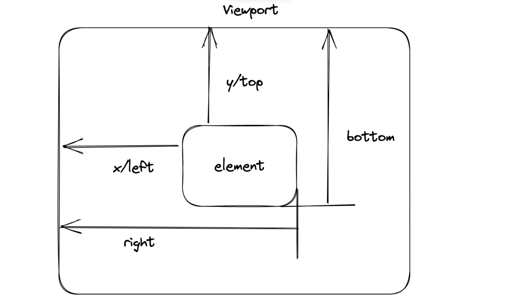

# vue 指令详解

平时没有怎么用过指令 这次通过讲解 `element-ui` 中的 `loading` 指令去解释平时指令的使用

## 指令注册

通过全局的方式注册指令:

```js
Vue.directive('loading', {
    // el 当前指令绑定的实例对象
    // binding 指令的修复符 表达式 表达式值 旧表达式值等
    // vNode vue的一个实例对象
    // bind 指令挂载的时候调用一次
    bind(el, binding, vNode) {
        // 在绑定指令的元素上添加属性 用于覆盖默认的text等值
        const textExr = el.getAttribute('element-loading-text')
        const spinnerExr = el.getAttribute('element-loading-spinner')
        const backgroundExr = el.getAttribute('element-loading-background')
        const customClassExr = el.getAttribute('element-loading-custom-class')
        // 获取当前绑定指令的的vue的实例对象
        const vm = vNode.context
        // 创建一个子组件
        const mask = new Mask({
            el: document.createElement('div'),
            data: {
                text: (vm && vm[textExr]) || textExr,
                spinner: (vm && vm[spinnerExr]) || spinnerExr,
                background: (vm && vm[backgroundExr]) || backgroundExr,
                customClass: (vm && vm[customClassExr]) || customClassExr,
                fullscreen: !!binding.modifiers.fullscreen,
            },
        })
        el.instance = mask
        el.mask = mask.$el
        el.maskStyle = {}
        binding.value && toggleLoading(el, binding)
    },

    // 更新的时候调用 判断oldValue 和 value的值可以比较是否需要更新指令
    update(el, binding) {
        el.instance.setText(el.getAttribute('element-loading-text'))
        if (binding.oldValue !== binding.value) {
            toggleLoading(el, binding)
        }
    },
    // 销毁元素
    unbind(el, binding) {
        if (el.domInserted) {
            el.mask && el.mask.parentNode && el.mark.parentNode.removeChild(el.mask)
            // 取消loading
            toggleLoading(el, {
                value: false,
                modifiers: binding.modifiers
            })
        }
        // 销毁元素
        el.instance && el.instance.$destroy()
    },
})
```

## loading 源码解析

`index.js` 用于 `Vue` 服务注册

```js
import directiveLoading from './directive'

// vue 指令 会调用对象中的install 方法 这里和源码中的不同 省略了directive 以及serve的属性导出
export default {
    install(Vue) {
        Vue.use(directiveLoading)
    },
}
```

`directive.js` 源码:

```js
import Vue from 'vue'
import {
    getStyle,
    afterLeave
} from '@/utils'
import {
    removeClassName,
    addClassName
} from '@cc-heart/dom-utils'
import Loading from './Loading.vue'
// 创建一个vue的组件构造函数
const Mask = Vue.extend(Loading)
const loadingDirective = {}
loadingDirective.install = (Vue) => {
    const insertDom = (parent, el, binding) => {
        // dom还没有被插入到dom树中并且元素可见
        if (
            !el.domVisible &&
            getStyle(el, 'display') !== 'none' &&
            getStyle(el, 'visibility') !== 'hidden'
        ) {
            // style 属性转移
            Object.keys(el.maskStyle).forEach((property) => {
                el.mask.style[property] = el.maskStyle[property]
            })

            // 如果父元素没有脱标 则父元素添加相对定位 mask有 el-loading-mask: {    position: absolute; }
            if (
                el.originalPosition !== 'absolute' &&
                el.originalPosition !== 'fixed' &&
                el.originalPosition !== 'sticky'
            ) {
                addClassName(parent, 'el-loading-parent--relative')
            }
            if (binding.modifiers.fullscreen && binding.modifiers.lock) {
                addClassName(parent, 'el-loading-parent--hidden')
            }

            // dom可见
            el.domVisible = true

            // 元素添加到 dom中
            parent.appendChild(el.mask)

            Vue.nextTick(() => {
                // 如果元素正在进行隐藏操作 则触发 after-leave
                if (el.instance.hiding) {
                    el.instance.$emit('after-leave')
                } else {
                    // insert-info 一定是 value 为 true的时候触发的 此时如果 hiding状态结束了 则元素可见 visible = true
                    el.instance.visible = true
                }
            })
            // 标识dom已经插入过了
            el.domInserted = true
        } else if (el.domVisible && el.instance.hiding === true) {
            // 元素插入了 但是在隐藏的操作中 正处在 afterLeave 的callback没用回调的时候 无需等待动画结束 可以直接改变状态显示
            el.instance.visible = true
            el.instance.hiding = false
        }
    }
    const toggleLoading = (el, binding) => {
        // 如果 loading的值为true的时候
        if (binding.value) {
            // 如果带有全屏的指令
            if (binding.modifiers.fullscreen) {
                el.originalPosition = getStyle(document.body, 'position')
                el.originalOverflow = getStyle(document.body, 'overflow')
                el.maskStyle.zIndex = PopupManager.nextZIndex()
                // 根元素添加上属性
                addClassName(el.mask, 'is-fullscreen')
                insertDom(document.body, el, binding)
            } else {
                removeClassName(el.mask, 'is-fullscreen')
                if (binding.modifiers.body) {
                    // 挂在到 body上面
                    el.originalPosition = getStyle(document.body, 'position')

                    // 计算mask的偏移量
                    ;
                    ['top', 'left'].forEach((property) => {
                        const scroll = property === 'top' ? 'scrollTop' : 'scrollLeft'
                        el.maskStyle[property] =
                            el.getBoundingClientRect()[property] +
                            document.body[scroll] +
                            document.documentElement[scroll] -
                            parseInt(getStyle(document.body, `margin-${property}`), 10) +
                            'px'
                    })
                    // 计算mask的 遮罩层大小
                    ;
                    ['height', 'width'].forEach((property) => {
                        el.maskStyle[property] = el.getBoundingClientRect()[property] + 'px'
                    })
                } else {
                    el.originalPosition = getStyle(el, 'position')
                    insertDom(el, el, binding)
                }
            }
        } else {
            afterLeave(el.instance, () => {
                if (!el.instance.hiding) return
                el.domVisible = false
                const target =
                    binding.modifiers.fullscreen || binding.modifiers.body ?
                    document.body :
                    el
                removeClassName(target, 'el-loading-parent--relative')
                removeClassName(target, 'el-loading-parent--hidden')
                // 隐藏操作结束 标记为false
                el.instance.hiding = false
            })
            el.instance.visible = false
            el.instance.hiding = true // 隐藏操作中
        }
    }
    Vue.directive('loading', {
        bind(el, binding, vNode) {
            console.log(el, binding, vNode)
            const textExr = el.getAttribute('element-loading-text')
            const spinnerExr = el.getAttribute('element-loading-spinner')
            const backgroundExr = el.getAttribute('element-loading-background')
            const customClassExr = el.getAttribute('element-loading-custom-class')
            // 获取当前绑定指令的的vue的实例对象
            const vm = vNode.context
            // 创建一个子组件
            const mask = new Mask({
                el: document.createElement('div'),
                data: {
                    text: (vm && vm[textExr]) || textExr,
                    spinner: (vm && vm[spinnerExr]) || spinnerExr,
                    background: (vm && vm[backgroundExr]) || backgroundExr,
                    customClass: (vm && vm[customClassExr]) || customClassExr,
                    fullscreen: !!binding.modifiers.fullscreen,
                },
            })
            el.instance = mask
            el.mask = mask.$el
            el.maskStyle = {}
            binding.value && toggleLoading(el, binding)
        },

        update(el, binding) {
            el.instance.setText(el.getAttribute('element-loading-text'))
            if (binding.oldValue !== binding.value) {
                toggleLoading(el, binding)
            }
        },
        unbind(el, binding) {
            if (el.domInserted) {
                el.mask && el.mask.parentNode && el.mark.parentNode.removeChild(el.mask)
                // 取消loading
                toggleLoading(el, {
                    value: false,
                    modifiers: binding.modifiers
                })
            }
            // 销毁元素
            el.instance && el.instance.$destroy()
        },
    })
}

export default loadingDirective
```

`loading.vue` 源码：

```vue
<template>
  <transition name="el-loading-fade" @after-leave="handleAfterLeave">
    <div
      v-show="visible"
      class="el-loading-mask"
      :style="{ backgroundColor: background || '' }"
      :class="[customClass, { 'is-fullscreen': fullscreen }]"
    >
      <div class="el-loading-spinner">
        <svg v-if="!spinner" class="circular" viewBox="25 25 50 50">
          <circle class="path" cx="50" cy="50" r="20" fill="none" />
        </svg>
        <i v-else :class="spinner"></i>
        <p v-if="text" class="el-loading-text">{{ text }}</p>
      </div>
    </div>
  </transition>
</template>

<script>
export default {
  name: 'LoadingVue',
  data() {
    return {
      text: null,
      spinner: null,
      background: null,
      fullscreen: true,
      visible: false,
      customClass: '',
    }
  },

  methods: {
    handleAfterLeave() {
      this.$emit('after-leave')
    },
    setText(text) {
      this.text = text
    },
  },
}
</script>
```

`utils` 工具类:

```js
export const getStyle = function(element, styleName) {
    if (!element || !styleName) return null
    // 转驼峰
    // styleName = camelCase(styleName)
    try {
        const computed = document.defaultView.getComputedStyle(element, '')
        return element.style[styleName] || computed ? computed[styleName] : null
    } catch (e) {
        return element.style[styleName]
    }
}

export function afterLeave(instance, callback, speed = 300, once = false) {
    if (!instance || !callback)
        throw new Error(' instance & callback is required')
    let called = false
    const afterLeaveCallback = function() {
        if (called) return
        called = true
        if (callback) {
            callback.apply(null, arguments)
        }
    }

    if (once) {
        instance.$once('after-leave', afterLeaveCallback)
    } else {
        instance.$on('after-leave', afterLeaveCallback)
    }

    setTimeout(() => {
        afterLeaveCallback()
    }, speed + 100)
}
```

`popup.js` 部门源码：

```js
const PopupManager = {
    // ...
    nextZIndex: function() {
        return PopupManager.zIndex++
    },
}
Object.defineProperty(PopupManager, 'zIndex', {
    configurable: true,
    get() {
        if (!hasInitZIndex) {
            zIndex = zIndex || (Vue.prototype.$ELEMENT || {}).zIndex || 2000
            hasInitZIndex = true
        }
        return zIndex
    },
    set(value) {
        zIndex = value
    },
})
```

## getBoundingClientRect 的属性解析



## 参考资料

* [element-ui loading directive](https://element.eleme.io/#/zh-CN/component/loading#options)

* [vue directive](https://v2.cn.vuejs.org/v2/guide/custom-directive.html)
